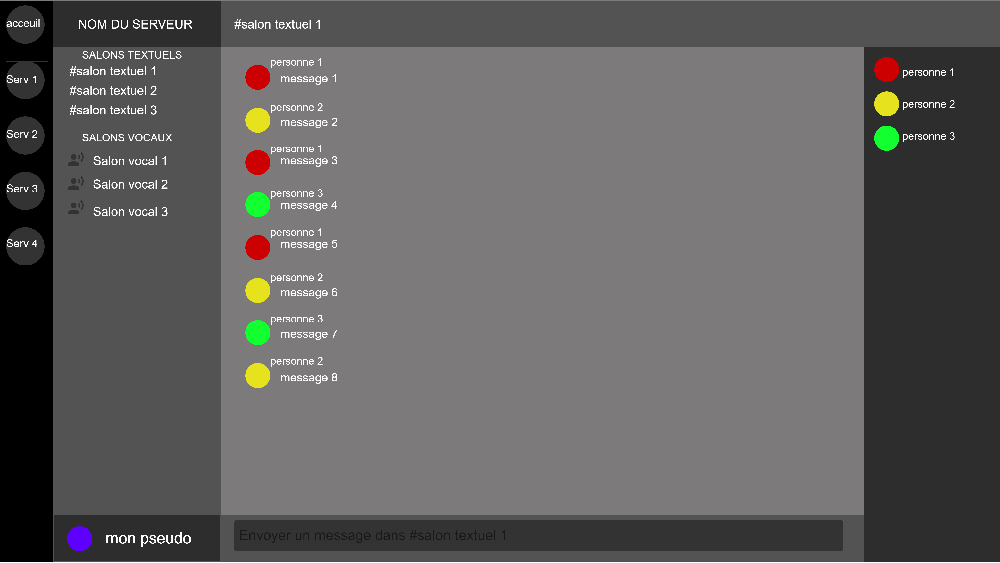
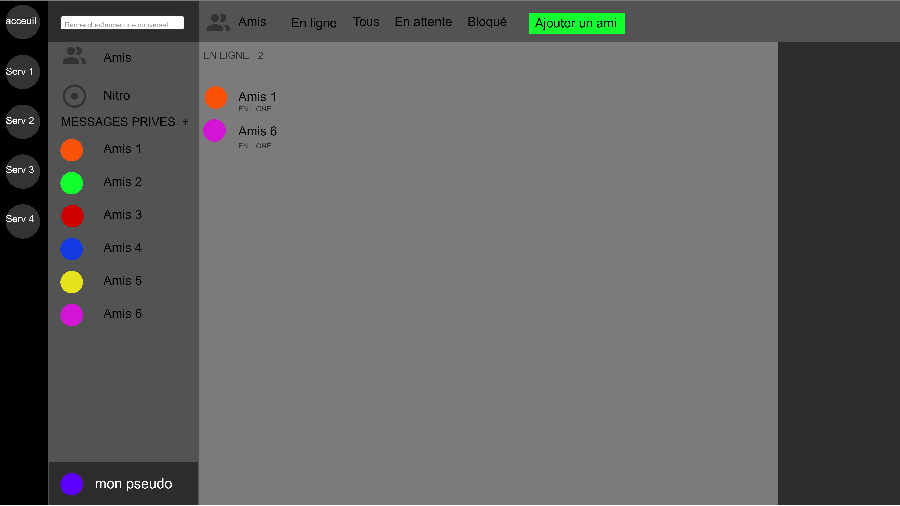
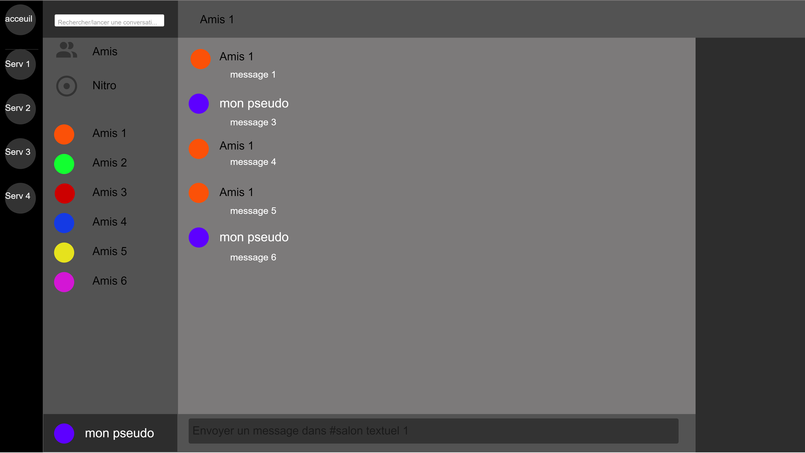

Rétroconception de Discord
==========================
AsciidocFX
:doctype: article
:encoding: utf-8
:lang: fr
:toc: left
:numbered: right

**Maxime Le Devedec & Clément Combettes--sol**

Groupe 2A

<<<

== [underline]#Maquettes d'écrans#

=== [underline]#Dans un serveur#

=== [underline]#Dans l'acceuil#

=== [underline]#Dans une conversation privée#

== [underline]#Diagramme de classe#

[plantuml, diagramme-de-classe, png]
....
@startuml

skinparam headerFontSize 20
skinparam headerFontColor black
header <u>Diagramme de classe de Discord</u>

hide circle

class Compte {
    #Identifiant
    Pseudo
    PhotoDeProfil
    numeroTel
    email
    listServeur
    listAmis
    }

class Etat {
    mute
    sourd
    connecte
    absent
    nePasDeranger
    invisible
}

class Message {
    #Identifiant
    Contenu
    date 
    heure 
    longeur
}

class Discussion { 
Personne1
Personne1
listMessage
AppelVocal
}

class Serveur {
    #Identifiant
    nom 
    listChannel
    permission
    rôles
    listCompte
}

class DossierChannel {
    #Identifiant
    nom
    listChannel
    permission
}

class Channel {
    #Identifiant
    nom
    type
        textuel
            listMessage
        vocal
            place
            listCompte
    permission
}

class Overlay {
    position
    taille 
    listJeux
    listCompte
}

Compte "1..*" -r- "1..*" Serveur
Compte "2" -- "0..*" Message
Compte "1" -l- "1" Overlay
Compte "1" -- "1" Etat

Serveur "0..*" <|-d- "1" DossierChannel
Serveur "0..*" <|-r- "1" Channel
Message "1..*" <|-- "1" Discussion

@enduml
....

== [underline]#Diagramme de cas d'utilisation#

[plantuml, diagramme-de-cas-d'utilisation, png]
....
@startuml

skinparam headerFontSize 20
skinparam headerFontColor black
header <u>Diagramme de cas d'utilisation de Discord</u>

:Utilisateur 1: as uti1
:Utilisateur 2: as uti2
:Modérateur: as mod 

mod --|> uti1
mod -l-|> uti2

rectangle "Serveur" {
    (Création de serveur) as serv
    (Dossier de channel) as dos 
    (Channel) as cha
    (Modération du serveur) as modserv
    (Rejoindre un serveur discord) as rj

}

rectangle "Personnel" {
    (Discussion) as dis
    (Appel) as ap 
    (Message) as msg  
    (Amis) as ami
}

serv <|-- dos
serv <|-- cha

dis <|-- ap
dis <|-- msg
dis <|-- ami

uti1 --> dis
uti1 --> serv
uti1 --> modserv 
mod --> modserv
uti2 --> rj
uti2 --> dis

@enduml

....

== [underline]#Diagramme de séquences#

[plantuml, diagramme-de-classe, png]
....
@startuml

skinparam headerFontSize 20
skinparam headerFontColor black
header <u>Diagramme de séquences de Discord</u>

actor ":Utilisateur" as uti
participant ":Système" as sys

uti -> sys: DemandeConnection
sys --> uti: ConnectionEffectué
'------------------------
uti -> sys: DemandeCréationServeur
sys --> uti: ServeurPrivée
'------------------------
uti -> sys: CréationInvitation
sys --> uti: RaccourciRejoindreServeur
'------------------------
uti -> sys: DemandeCréationSalon
uti --> sys: SalonPrivé
'------------------------
uti -> sys: PermissionPersonnalisable
sys --> uti: AppliquePermission
'------------------------
loop Pour chaque message ou appel envoyé
uti -> sys: MessagePrivée
sys --> uti: EnvoieDuMessage
'------------------------
uti -> sys: AppelAmi
sys --> uti: CréationVocalPrivée
end
@enduml
....